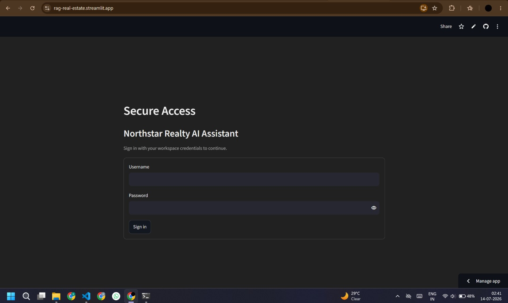
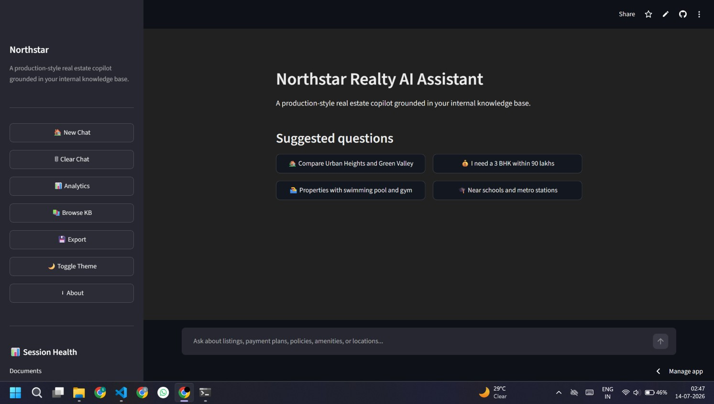
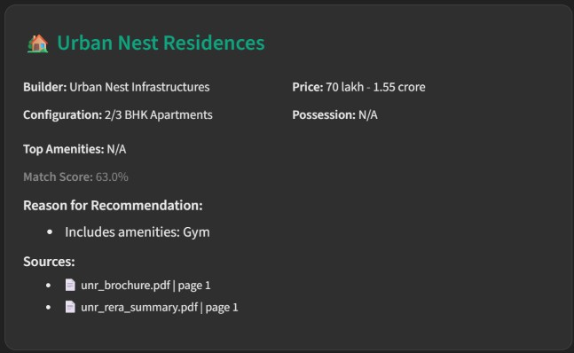
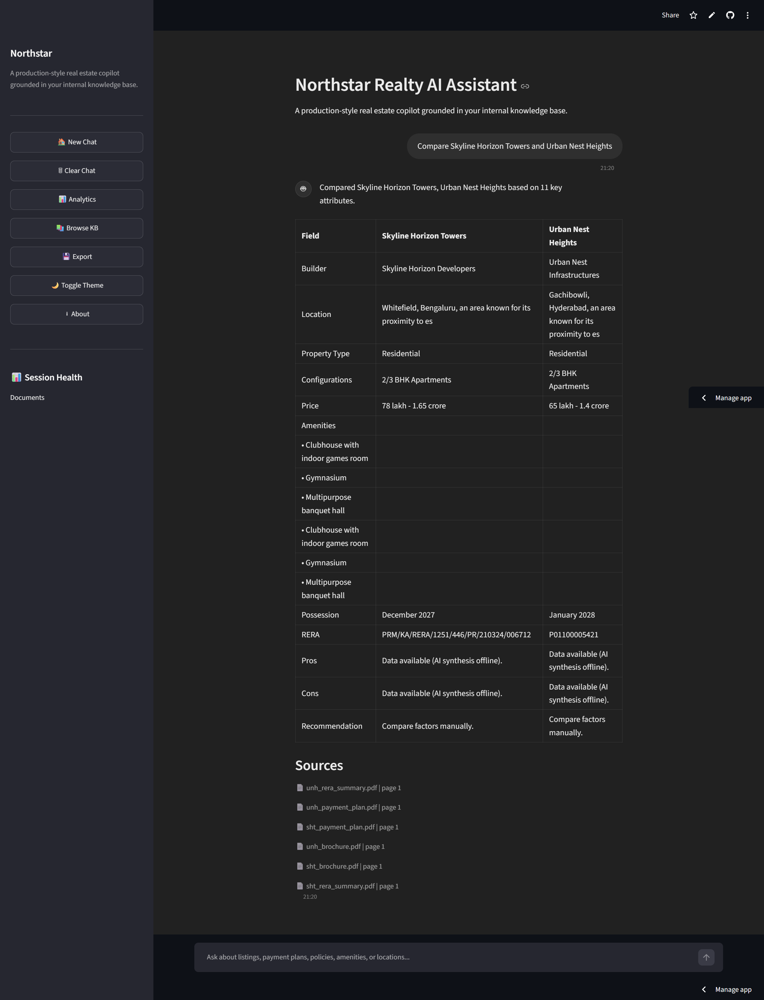
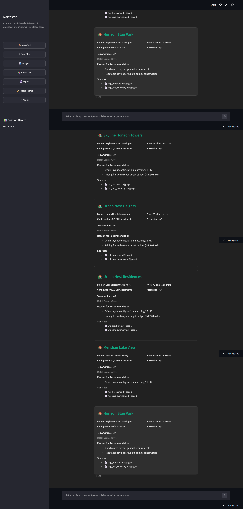

# Northstar Realty AI Assistant (RAG)

A production-style real estate copilot built with **Streamlit + Retrieval-Augmented Generation (RAG)**. It answers real estate questions, provides citations from your internal knowledge base, and supports property comparison & recommendations.

---

## Features

- **Grounded Q&A with citations**: Answers are generated using retrieved knowledge base context and include source document references.
- **Property comparison**: “Project A vs Project B” queries produce a structured comparison table.
- **Smart recommendations**: Natural-language preferences are parsed and used to rank relevant properties.
- **Retrieval transparency**: Streamlit UI shows retrieved sources and similarity-based confidence.
- **Conversation memory**: Last N conversation turns are included to preserve conversational context.
- **Export**: Download conversations as **TXT, Markdown, JSON, PDF**.
- **Admin-style login**: Basic authentication for app access.

---

## Tech Stack

- **Frontend**: Streamlit
- **Backend / RAG Core**: Python
- **Document parsing**: `pypdf`, `python-docx`, `BeautifulSoup`
- **Text chunking**: LangChain `RecursiveCharacterTextSplitter`
- **Embeddings**: SentenceTransformers `sentence-transformers/all-MiniLM-L6-v2`
- **Vector store**: FAISS (`IndexFlatIP`) with persistent on-disk index + metadata
- **LLM**: Google Gemini (`google-generativeai`)

---

## Folder Structure

```text
RAG_Real_Estate/
├── app.py                          # Streamlit entrypoint
├── config.py                       # App configuration
├── requirements.txt               
├── README.md
├── .env.example
├── docs/
│   └── ARCHITECTURE.md
├── knowledge_base/               # Source documents (PDF/DOCX/HTML/MD/TXT)
│   └── ...
├── vector_store/                 # Auto-generated FAISS index artifacts
│   ├── faiss_index.bin
│   ├── metadata.pkl
│   └── manifest.json
└── utils/
    ├── rag_engine.py              # Ingestion/retrieval/prompting/generation
    ├── loader.py                  # Document loading + normalization
    ├── splitter.py                # Chunking wrapper
    ├── embeddings.py              # Embedding generation
    ├── vector_store.py           # FAISS index persistence + search
    ├── comparison.py              # Comparison engine
    ├── recommendation.py         # Recommendation engine
    ├── retrieval_tracker.py      # UI progress stages
    ├── cache.py                   # Simple in-memory query cache
    └── exporter.py               # Session export helpers
```

---

## Architecture

See: `docs/ARCHITECTURE.md`.

---

## Retrieval, Chunking & Grounding (High Level)

1. **Ingestion**: Documents under `knowledge_base/` are loaded and normalized.
2. **Chunking**: Text is split into overlapping chunks (configurable).
3. **Embeddings**: Each chunk is embedded using SentenceTransformers.
4. **Indexing**: Vectors are stored in a FAISS index with chunk metadata.
5. **Query-time retrieval**: User query embedding retrieves top-k similar chunks.
6. **Generation**: Gemini is prompted with:
   - retrieved context
   - conversation memory
   - strict refusal instructions

If the model cannot find supporting information in retrieved context, it must output:

> `I couldn't find reliable information in the provided knowledge base.`

---

## Setup Instructions

### Prerequisites

- Python **3.10+**

### 1) Create a virtual environment

```bash
python -m venv .venv
.venv\Scripts\activate
```

### 2) Install dependencies

```bash
pip install -r requirements.txt
```

### 3) Configure environment variables

Create a `.env` file (or set environment variables) based on `.env.example`.

```bash
# Windows example
set GOOGLE_API_KEY=your_gemini_api_key
set LOGIN_USERNAME=northstar
set LOGIN_PASSWORD=your_password
```

### 4) Put documents in the knowledge base

Place source files inside:

- `knowledge_base/`

Supported formats:

- PDF, DOCX
- HTML
- Markdown
- TXT

### 5) Run the app

```bash
streamlit run app.py
```

Open the app at:

- `http://localhost:8501`

---

## Environment Variables

| Variable | Required | Description |
|---|---:|---|
| `GOOGLE_API_KEY` | Yes (for generation) | Gemini API key |
| `LOGIN_USERNAME` | Optional | Basic auth username |
| `LOGIN_PASSWORD` | Optional | Basic auth password |

> If `GOOGLE_API_KEY` is missing, the app will still perform retrieval, but generation will be unavailable.

---

## Deployment Guide

### Local deployment

1. Set `GOOGLE_API_KEY` and auth credentials.
2. Run `streamlit run app.py`.

### Streamlit Community Cloud / similar

1. Add secrets/environment variables for `GOOGLE_API_KEY`.
2. Deploy `app.py`.
3. Ensure `knowledge_base/` files are included in the deployment bundle.

---

## Screenshots

Placeholder images (replace with real captures):

- 
- 
- 
- 
- 

---

## Future Improvements

- Add semantic reranking (cross-encoder or LLM-based reranker)
- Add stronger chunking for tables and sections
- Implement structured extraction for comparison/recommendations using LLM + validators
- Add feedback loop for recommendation quality
- Add rate limiting and audit logs
- Multi-language support
- Optional REST API layer for external integrations

---

## Notes / Limitations

- This system is only as accurate as the documents present in `knowledge_base/`.
- Citation presence is surfaced in the UI, and the model is instructed to refuse when context is insufficient.

---

## License

MIT (or your preferred license).

