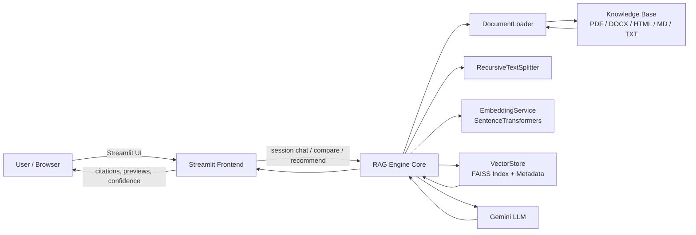

# Architecture

```mermaid
flowchart LR
  U[User / Browser] -->|Streamlit UI| UI[Streamlit Frontend]

  UI -->|session chat / compare / recommend| CORE[RAG Engine Core]

  CORE --> LOADER[DocumentLoader]
  CORE --> SPLITTER[RecursiveTextSplitter]
  CORE --> EMB[EmbeddingService\nSentenceTransformers]
  CORE --> VS[VectorStore\nFAISS Index + Metadata]
  CORE --> LLM[Gemini LLM]

  LOADER --> KB[Knowledge Base\nPDF / DOCX / HTML / MD / TXT]
  VS --> CORE
  KB --> LOADER
  LLM --> CORE

  CORE --> UI
  UI -->|citations, previews, confidence| U
```

